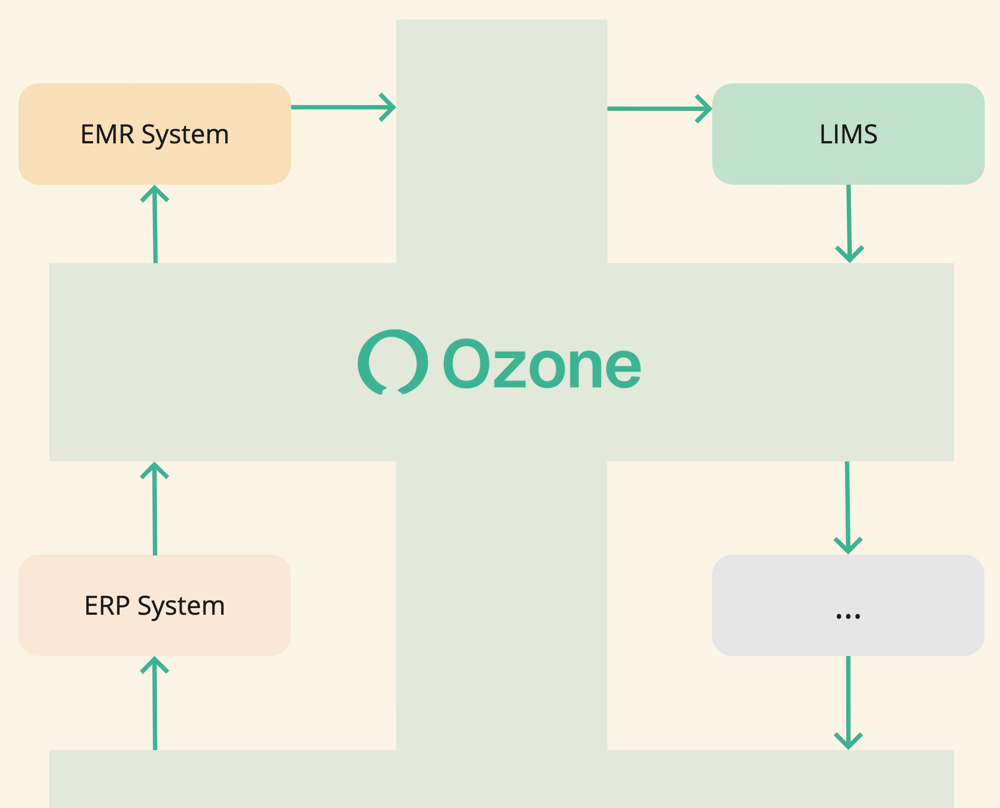
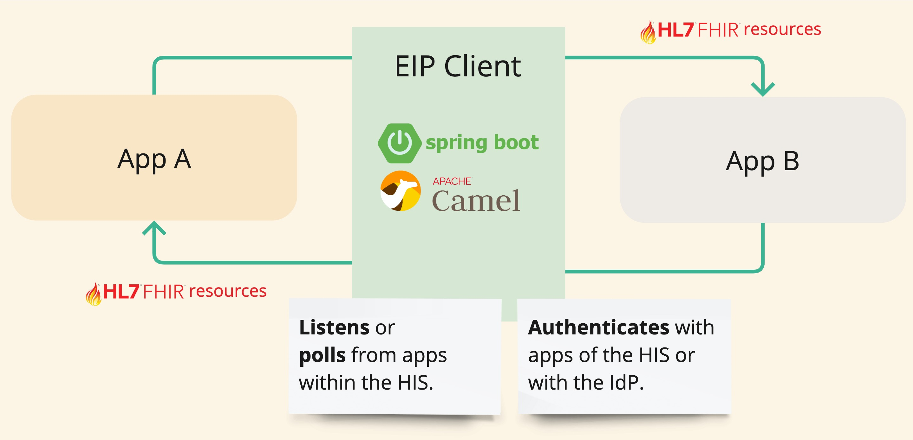

!!! info ""

    This section of the Ozone Docs is designed for **software architects, engineers, and developers**. It provides comprehensive information on Ozone's architecture, guides on integrating new software components, and technical advice on developing within Ozone.

# Architecture Overview

## Ozone Platform

Ozone Platform serves as the interoperability layer that seamlessly integrates HIS components by enabling data flows between them:

<figure markdown>
  { width="600" }
  <figcaption>HIS components glued with configurable data flows.</figcaption>
</figure>

Ozone Platform is a decenstralised mesh of peer-to-peer interoperability services, each an instance of Ozone's **EIP Client**.

Each service connects a pair of HIS components of Ozone's digital health sofware suite:

<figure markdown>
  { width="600" }
  <figcaption>Mesh of peer-to-peer services integrating HIS components.</figcaption>
</figure>

## Ozone's EIP Client

The core of the Ozone Platform is powered by the EIP Client(1), a Spring Boot application that runs Apache Camel routes. This application acts as the ETL[^etl] agent between two components of the HIS.
{ .annotate }

1.  <a target="_blank" href="https://camel.apache.org/components/4.0.x/eips/enterprise-integration-patterns.html"><b>E</b>nterprise <b>I</b>ntegration <b>P</b>atterns</a>

[^etl]: Extract, Transform, Load

<figure markdown>
  { width="600" }
  <figcaption>Peer-to-peer service between two HIS components.</figcaption>
</figure>

The EIP Client facilitates the **exchange of FHIR resources** between two components of Ozone's digital health software suite. This exchange of FHIR resources is precisely what makes the data flows of Ozone HIS.

Development in Ozone primarily involves assembling peer-to-peer services using the EIP Client. This client is equipped with several built-in features, simplifying the development process:

- It's a ready-to-use application designed for implementing Camel routes.
- It manages authentication:

    * With Ozone FOSS's HIS components.
    * With Ozone Pro's Identity Provider (IdP). &nbsp;&nbsp;{==:oz: Pro==}

- It includes a variety of common libraries to implement data flows that can be reused across different services.

## Missing :fhir:FHIR APIs

Many software components do not provide a FHIR API, often because they are not healthcare-specific, such as ERP systems. When this occurs, there are two possible solutions:

### **1** &nbsp; Lobby for the inclusion of a FHIR API

The ideal solution is to advocate for the software editor or development community to include a FHIR API as part of the software itself.

Generally, this can be achieved gradually with minimal effort by focusing on the subset of FHIR resources most needed to accomplish the desired flows within Ozone HIS. Often, only a couple of resources are required, and not all operations need to be supported for those resources.

### **2** &nbsp; Development of a Camel FHIR facade

When advocating for a FHIR API inclusion is not feasible or unsuccessful, an alternative solution is to develop a FHIR facade using Camel. This approach involves introducing the necessary FHIR resources via a new Camel component that extends the existing software from the outside.