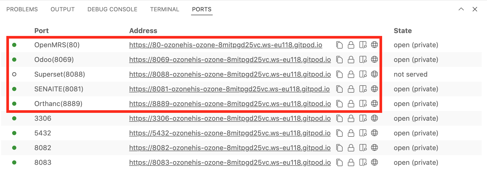

Just one click:

!!! warning ""

    :fontawesome-regular-hourglass-half: It may take some time to download and setup Ozone for the first time.

Gitpod will automatically launch a new tab for OpenMRS 3.

You can navigate to other Ozone apps of the HIS via the `PORTS` tab of the Terminal panel in the Gitpod editor:

Each app of the HIS will require you to log in separately with their own credentials:

| **App**                      | **Username**                                 | **Password**                            |
|----------------------------------------|----------------------------------------------|-----------------------------------------|
| OpenMRS 3                              | admin                                        | Admin123                                |
| SENAITE                                | admin                                        | password                                |
| Odoo                                   | admin                                        | admin                                   |
| Superset                               | admin                                        | password                                |
| ERPNext | administrator | password |
