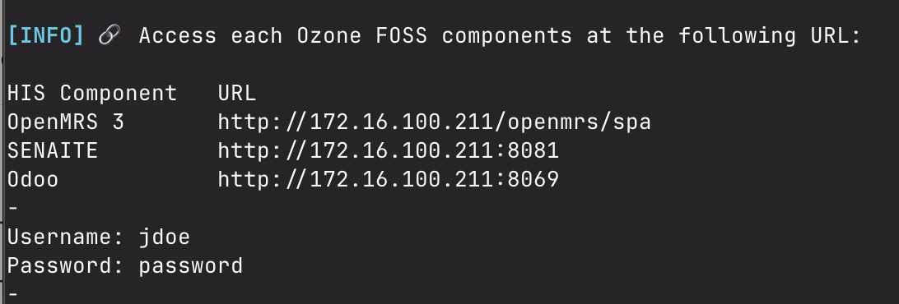
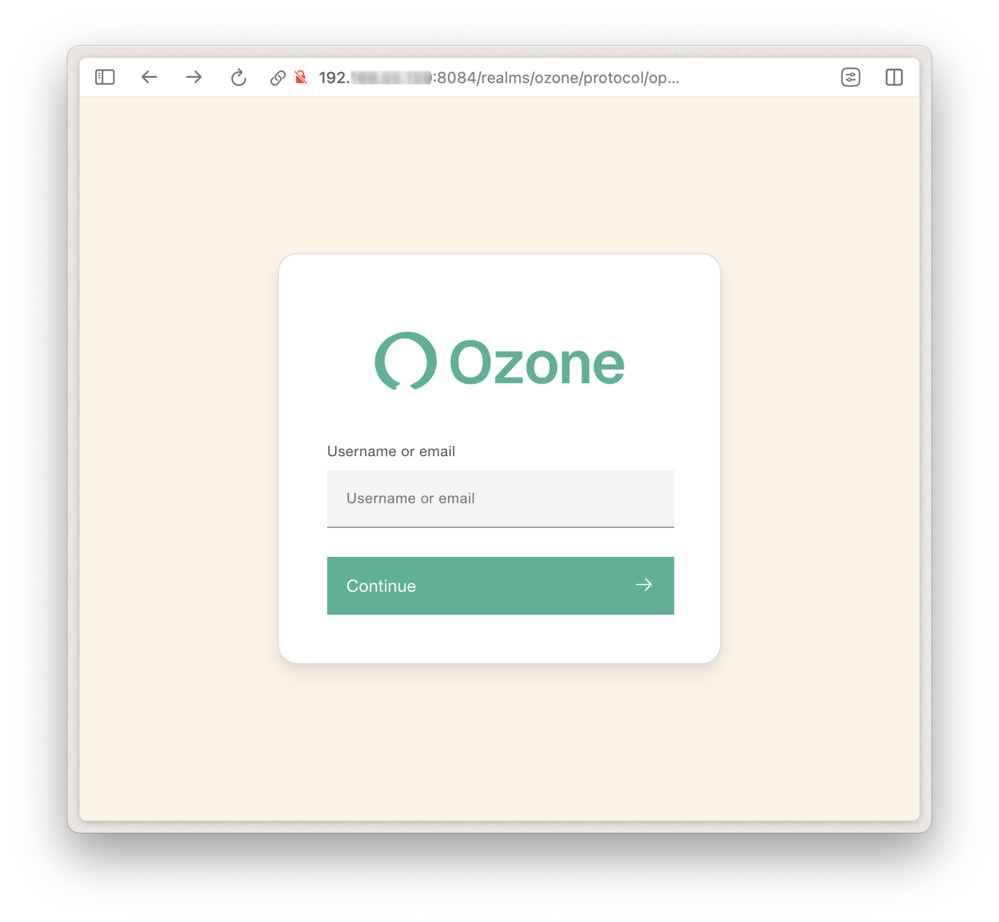

## Download and start

!!! info "System Requirements"
    
    To run Ozone and its apps smoothly, your environment should meet at least the following requirements:

    - 12 GB of free RAM
    - 8 core CPU
    - 25 GB for free space
    - High speed internet

Running the Ozone demo locally takes just three terminal commands:

```bash
curl -s https://raw.githubusercontent.com/ozone-his/ozone/main/scripts/install-stable.sh | bash /dev/stdin
```

```bash
cd ozone/run/docker/scripts/
```

```bash
./start-demo-with-sso.sh
```

!!! warning ""

    :fontawesome-regular-hourglass-half: It may take some time to download and setup Ozone for the first time.

## Browse
Once started, the script will output the URLs to access the HIS apps and services:

For example:



Accessing any of those URLs should present you the Single Sign-On portal page:



Log in to the demo using username **jdoe** and password **password**.

You're ready to start browsing Ozone 👏 !

!!! warning ""

    🛠️ If you encounter an error when trying to access OpenMRS specifically, you may need to apply the following command to force a restart of the OpenMRS service.
    ```curl
    docker restart ozone-openmrs-1
    ```
## Shut down the server

Once you're done browsing Ozone, you can destroy the server to keep your environment clean.

```bash
./destroy-demo.sh
```
