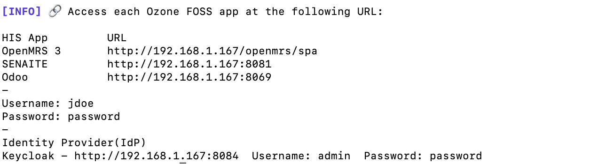

Only three commands in a terminal:

```bash
curl -s https://raw.githubusercontent.com/ozone-his/ozone/main/scripts/install-stable.sh | bash /dev/stdin
```

```bash
cd ozone/run/docker/scripts/
```

```bash
./start-demo-with-sso.sh
```

!!! warning ""

    :fontawesome-regular-hourglass-half: It may take some time to download and setup Ozone for the first time.

Once started, the script will output the URLs to access the services locally.
For example:


Then, start browsing Ozone:

| **App**                      | **URL**                                                                                     |
|----------------------------------------|---------------------------------------------------------------------------------------------|
| OpenMRS 3                              | <a href="http://localhost/openmrs/spa" target="_blank">http://localhost/openmrs/spa</a>     |
| SENAITE                                | <a href="http://localhost:8081/senaite" target="_blank">http://localhost:8081/senaite</a>   |
| Odoo                                   | <a href="http://localhost:8069" target="_blank">http://localhost:8069</a>                   |
| Superset                               | <a href="http://localhost:8088" target="_blank">http://localhost:8088</a>                   |
| <span class='secondary'>ERPNext</span> | <a class='secondary' href="http://localhost:8082" target="_blank">http://localhost:8082</a> |
