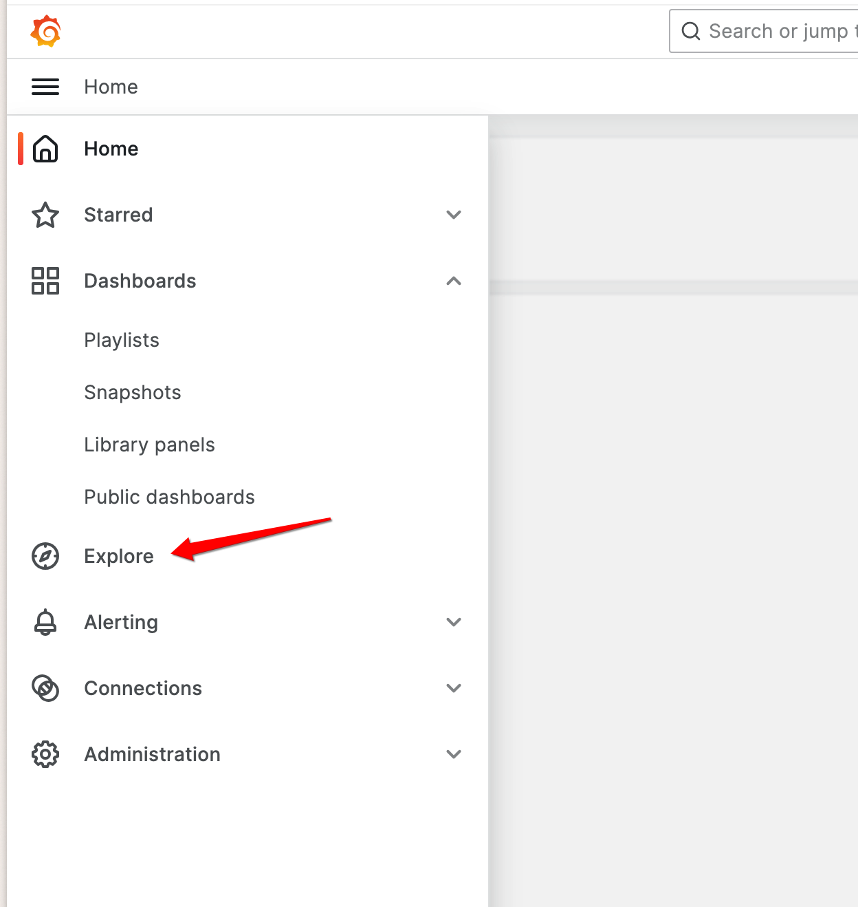
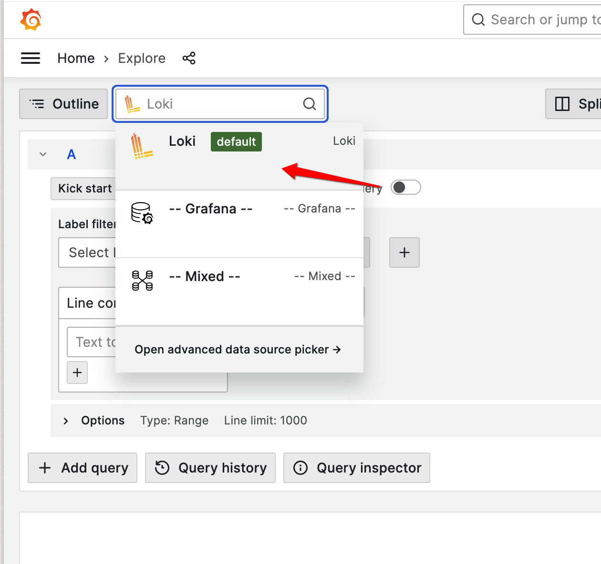
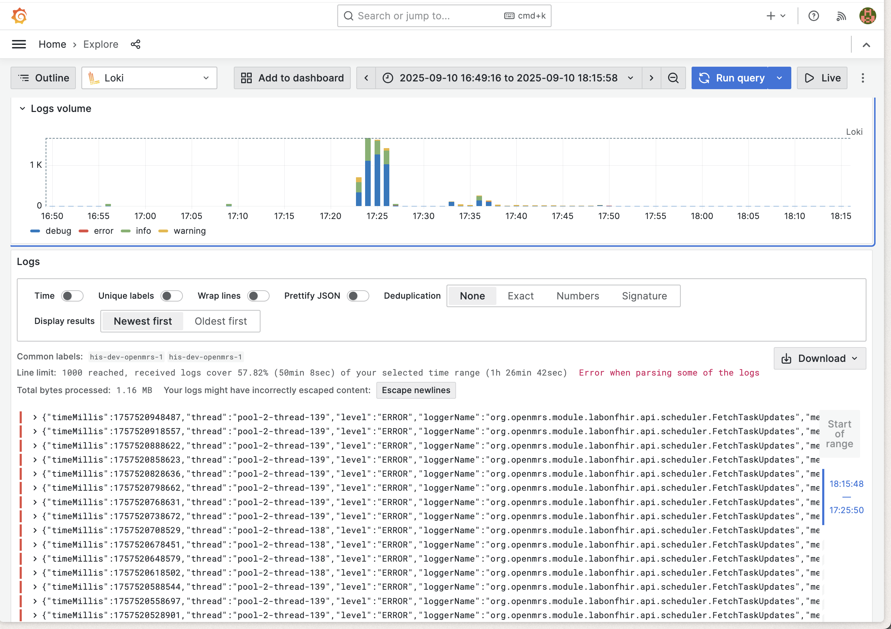
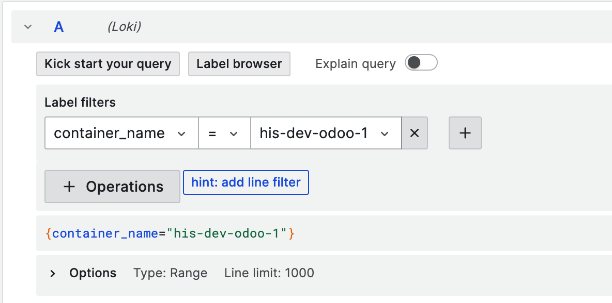

# Logging

Log analysis is crucial for monitoring, troubleshooting, and maintaining your Ozone deployment. This guide focuses on how to query and analyze logs from your Ozone services using Grafana and LogQL.

## Overview

Ozone comes with built-in centralized logging using Grafana Agent, Loki, and Grafana. All services output structured logs that are automatically collected and made available for querying and analysis through Grafana's interface.

## Log Levels

Ozone supports standard log levels that can be configured per service:

- `ERROR` - Error conditions that need immediate attention
- `WARN` - Warning conditions that should be monitored
- `INFO` - General informational messages (default level)
- `DEBUG` - Detailed diagnostic information
- `TRACE` - Very detailed execution flow information

## Accessing Logs

### Grafana Interface

The primary way to access and query logs is through the Grafana interface:

1. **Navigate to Grafana** - Usually available at `http://your-domain:3000`
2. **Go to Explore** - Click on the "Explore" section in the left menu
{ width="400" } 
3. **Select Loki** - Choose Loki as your data source
{ width="500" } 
4. **Query logs** - Use plain LogQL or the Query Builder to filter and analyze your logs
5. **Run Query** - Click on `Run Query` to fetch the logs matching your query
 

## Log Structure and Labels

Ozone services output structured logs with consistent labeling for easy filtering and analysis:

### Available Log Labels

All log entries include these basic labels:

- `container_name` - The name of the container generating the log
- `job` - The logging job (typically "containerlogs")


??? example "Example: Filter Odoo logs only"

    This means that the first filter you can do in Grafana could be to filter by `container_name`.
    For instance, to explore the Odoo logs only:

    In LogQL, that would be:
    ```logql
    {container_name="his-dev-odoo-1"}
    ```
    Using the Grafana Query Builder:

    { width="500" } 

On top of the shared labels, each service will have its own set of labels.

### OpenMRS Logs

OpenMRS in Ozone is configured to output structured JSON logs with detailed metadata:

Example log line:
```json
{
  "timeMillis": 1754965124179,
  "thread": "pool-2-thread-2",
  "level": "WARN",
  "loggerName": "org.openmrs.util.OpenmrsUtil",
  "message": "Unable to find a runtime properties file at /openmrs/openmrs-runtime.properties",
  "endOfBatch": false,
  "loggerFqcn": "org.apache.logging.slf4j.Log4jLogger",
  "contextMap": {},
  "threadId": 54,
  "threadPriority": 5
}
```

Available JSON fields for OpenMRS:

- `timeMillis` - Log timestamp in milliseconds (epoch time)
- `level` - Log level (`ERROR`, `WARN`, `INFO`, `DEBUG`, `TRACE`)
- `loggerName` - Java logger class name
- `thread` - Processing thread name
- `message` - Log message content
- `endOfBatch` - Indicates if this is the last log in a batch
- `loggerFqcn` - Fully qualified class name of the logger
- `contextMap` - Mapped Diagnostic Context with request/user data
- `threadId` - Numeric thread identifier
- `threadPriority` - Thread priority level

### EIP/Camel Logs

EIP services output structured JSON logs with integration-specific metadata:

```json
{
  "@timestamp": "2025-08-08T11:26:54.391196959Z",
  "@version": "1",
  "message": "Polling Tasks completed.",
  "logger_name": "poll-senaite",
  "thread_name": "Camel (camel-1) thread #10 - CamelFhir",
  "level": "INFO",
  "level_value": 20000
}
```

**Available JSON fields for EIP:**
- `@timestamp` - Log timestamp in ISO 8601 format
- `@version` - Log format version
- `level` - Log level (`ERROR`, `WARN`, `INFO`, `DEBUG`, `TRACE`)
- `level_value` - Numeric log level value
- `logger_name` - Logger identifier (often route or component name)
- `thread_name` - Camel thread name with context information
- `message` - Log message content

### Odoo Logs

Odoo is a Python-based ERP service that outputs plain text logs in a structured format:

```
2025-08-11 05:25:39,107 83 INFO odoo odoo.modules.registry: Registry loaded in 21.265s
2025-08-11 05:25:39,106 83 INFO odoo odoo.addons.odoo_initializer.activator: initialization done
2025-08-11 05:25:39,103 83 INFO odoo odoo.addons.odoo_initializer.utils.data_files_utils: Skipping already processed file: ir.ui.view.1000.csv
```

Odoo log format structure:

- `YYYY-MM-DD HH:MM:SS,mmm` - Timestamp with milliseconds
- `PID` - Process ID (e.g., 83)
- `LEVEL` - Log level (DEBUG, INFO, WARNING, ERROR, CRITICAL)
- `database` - Database name (e.g., "odoo")
- `module` - Python module/addon name
- `message` - Log message content

!!! note
    Note Odoo logs are plain text, not JSON. Use regular expression patterns for filtering.

### SENAITE Logs

SENAITE is a Python-based LIMS service that outputs mixed log formats:

Python Application Logs:
Example log line:

```
2025-08-11 05:42:15,744 INFO    [senaite.jsonapi:60][waitress-1] Catalog query={'getClientID': '72f979bb-f153-41bd-9ffc-03128197e9d6', 'portal_type': 'AnalysisRequest', 'sort_order': 'ascending', 'getClientSampleID': '1a58e113-ff32-4e62-867b-365ff7d0e41c'}
```

- `YYYY-MM-DD HH:MM:SS,mmm` - Timestamp with milliseconds
- `LEVEL` - Log level (DEBUG, INFO, WARNING, ERROR, CRITICAL)
- `[module:line]` - Python module and line number
- `[thread]` - Thread name (e.g., waitress-1)
- `message` - Log message content


Nginx Access Logs:
Example log line:
```
172.23.0.11 - admin [11/Aug/2025:05:42:15 +0000] "GET /senaite/%40%40API/senaite/v1/AnalysisRequest?getClientSampleID=1a58e113-ff32-4e62-867b-365ff7d0e41c&getClientID=72f979bb-f153-41bd-9ffc-03128197e9d6&catalog=senaite_catalog_sample&complete=true HTTP/1.1" 200 6120 "-" "Apache-HttpClient/5.2.1 (Java/17.0.16)"
```

- Standard Nginx Combined Log Format
- `IP address`, `user`, `timestamp`, `request`, `status`, `size`, `referer`, `user-agent`


!!! note
    SENAITE logs are plain text, not JSON. Use regular expression patterns for filtering different log types.

### Other Container Logs

Services without structured JSON logging output standard container logs:

- Container name labeling for service identification
- Standard log levels and timestamps
- Plain text messages

## Querying Logs with LogQL

LogQL is Loki's query language for filtering and analyzing logs. This section provides practical examples for querying Ozone logs.

### Query Structure

All LogQL queries follow this basic structure:

```logql
{label_filters} | processing_stages | output_formatting
```

For Ozone logs, you'll typically start with container name filtering and then apply JSON parsing or regex matching depending on the service.

???+ example "Basic Filtering on the `container_name` label"

    ```logql
    # All logs from OpenMRS container
    {container_name="ozone-openmrs-1"}

    ```
    ```logql
    # All logs from EIP containers
    {container_name=~"ozone-eip-.*"}

    ```
    ```logql
    # All logs from specific Ozone services
    {container_name=~"ozone-openmrs-1|ozone-odoo-1|ozone-senaite-1"}
    ```

??? example "JSON Log Parsing (OpenMRS & EIP clients)"

    For services that output structured JSON logs.
    
    Always specify only the JSON fields you need (e.g., `json level` instead of `json`) to avoid high cardinality and improve query performance:

    ```logql
    # Filter OpenMRS logs by level
    {container_name="ozone-openmrs-1"} | json level | level="error"

    ```
    ```logql
    # Filter by specific logger
    {container_name="ozone-openmrs-1"} | json loggerName | loggerName=~".*OpenmrsUtil.*"

    ```
    ```logql
    # Monitor specific thread activity
    {container_name="ozone-openmrs-1"} | json thread | thread="pool-2-thread-2"

    ```
    ```logql
    # Database connection monitoring
    {container_name="ozone-openmrs-1"} | json loggerName | loggerName=~".*LocalContainerEntityManagerFactoryBean.*"

    ```
    ```logql
    # EIP integration monitoring
    {container_name=~"ozone-eip-.*"} | json logger_name | logger_name="poll-senaite"

    ```
    ```logql
    # Monitor Camel threads
    {container_name=~"ozone-eip-.*"} | json thread_name | thread_name=~".*Camel.*"
    ```

??? example "Simple Line Filter (Odoo & SENAITE)"

    For services that output plain text logs:

    ```logql
    # Filter Odoo logs by level
    {container_name="ozone-odoo-1"} |~ "ERROR|WARNING"

    ```
    ```logql
    # Monitor Odoo modules
    {container_name="ozone-odoo-1"} |~ "odoo\\.addons\\..*res_users"

    ```
    ```logql
    # SENAITE API monitoring
    {container_name="ozone-senaite-1"} |~ "GET /senaite/.*API"

    ```
    ```logql
    # Track SENAITE operations
    {container_name="ozone-senaite-1"} |~ "AnalysisRequest|getClientID"
    ```

??? example "Rate and Volume Queries"

    For monitoring error rates and log volume:

    ```logql
    # Error rate per minute by service
    rate({container_name="ozone-openmrs-1"} | json level | level="error"[1m])
    ```
    ```logql
    rate({container_name=~"ozone-eip-.*"} | json level | level="ERROR"[1m])
    ```
    ```logql
    rate({container_name="ozone-odoo-1"} |~ "ERROR"[1m])
    ```
    ```logql
    rate({container_name="ozone-senaite-1"} |~ "ERROR"[1m])

    # Total log volume per minute
    ```
    ```logql
    rate({container_name="ozone-openmrs-1"}[1m])
    ```
    ```logql
    rate({container_name=~"ozone-eip-.*"}[1m])
    ```
    ```logql
    rate({container_name="ozone-odoo-1"}[1m])
    ```
    ```logql
    rate({container_name="ozone-senaite-1"}[1m])
    ```

??? example "Aggregation Queries"

    For counting and grouping log entries:

    ```logql
    # Count of log entries by service over 5 minute windows
    sum by (container_name) (count_over_time({container_name=~"ozone-.*"}[5m]))
    ```
    ```logql
    # Count of errors by OpenMRS logger
    sum by (loggerName) (count_over_time({container_name="ozone-openmrs-1"} | json loggerName, level | level="error"[5m]))
    ```
    ```logql
    # Count of EIP activities by component
    sum by (logger_name) (count_over_time({container_name=~"ozone-eip-.*"} | json logger_name | logger_name!=""[5m]))
    ```
    ```logql
    # Top log generating threads in OpenMRS
    topk(5, sum by (thread) (count_over_time({container_name="ozone-openmrs-1"} | json thread[5m])))
    ```
    ```logql
    # Top error-generating threads in OpenMRS
    topk(5, sum by (thread) (count_over_time({container_name="ozone-openmrs-1"} | json thread, level | level="error"[5m])))
    ```
    ```logql
    # Count by log level across OpenMRS
    sum by (level) (count_over_time({container_name="ozone-openmrs-1"} | json level[5m]))
    ```

??? example "Time-based Analysis"

    For trending and historical analysis:

    ```logql
    # Error count over time windows
    count_over_time({container_name="ozone-openmrs-1"} | json level | level="error"[5m])
    ```
    ```logql
    # Integration poll activity trends
    count_over_time({container_name=~"ozone-eip-.*"} | json logger_name | logger_name=~".*poll.*"[5m])

    ```
    ```logql
    # Database activity over time
    count_over_time({container_name="ozone-openmrs-1"} | json loggerName | loggerName=~".*hikari.*"[5m])

    ```
    ```logql
    # Error rate trends
    rate({container_name="ozone-openmrs-1"} | json level | level="error"[5m])

    ```
    ```logql
    # Combined service activity over time
    sum(count_over_time({container_name=~"ozone-.*"}[5m])) by (container_name)
    ```

## Log Monitoring and Alerting

### Key Metrics to Monitor

Suggested patterns to monitor efficiently your logs and track system health:

1. **Error Rates**: Track `ERROR` and `WARN` level logs across all services
2. **Performance**: Monitor slow query logs and response times
3. **Authentication**: Track login failures and security events  
4. **Integration**: Monitor EIP message processing errors and timeouts
5. **Database**: Watch for connection pool exhaustion and deadlocks
6. **Camel Routes**: Monitor route failures and processing delays


## LogQL Queries Tips and Best Practices

### Query Optimization

1. **Start with container filters** - Always begin queries with container name filters to reduce search scope
2. **Use specific time ranges** - Limit queries to relevant time periods for better performance  
3. **Combine filters efficiently** - Use JSON pipe after initial filtering to minimize processing
4. **Leverage regex patterns** - Use regex for flexible pattern matching in log messages

!!! tip "EIP Integration Monitoring"
    Use EIP logs with `route_id` and `exchange_id` labels to trace individual message flows through your integration pipelines.

!!! tip "Performance Monitoring"
    Combine structured logging with Grafana metrics and APM tools for comprehensive system observability.

!!! warning "Label Management"
    Keep Loki labels minimal and use JSON pipe for detailed filtering. High cardinality labels can significantly impact Loki performance.


## Atlernative: Directly accessing logs using Docker CLI

As an alternative (if you are not running the logging service or just require quick access) you can still access logs directly in the terminal:

```bash
# View logs for a specific service
docker-compose -p <ozone> logs openmrs
```
```bash
# Follow logs in real-time
docker-compose -p <project> logs -f
```
```bash
# Limit log output
docker-compose -p <project> logs --tail=100 openmrs
```
```bash
# Display the 500 last log lines of a particular container and prettify the output when in JSON format
docker logs -f --tail=500 <container_name> | jq -R -M '(fromjson? // .)'
```