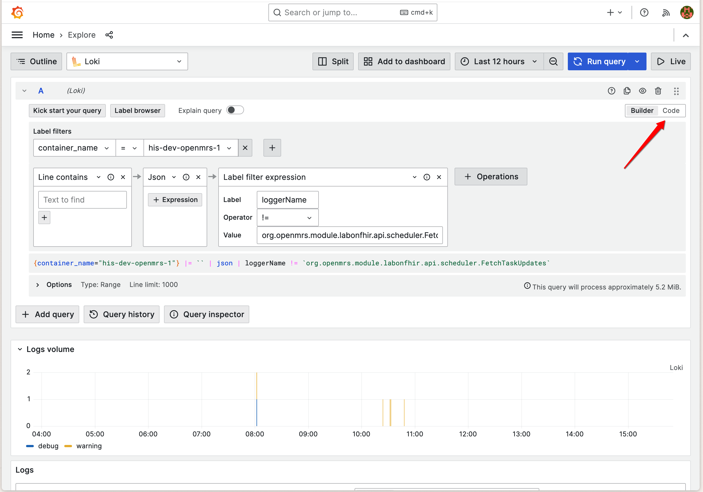

# Logging

Log analysis is crucial for monitoring, troubleshooting, and maintaining your Ozone deployment. This guide focuses on how to query and analyze logs from your Ozone services using Grafana and LogQL.

## Overview

Ozone comes with built-in centralized logging using Grafana Agent, Loki, and Grafana. All services output structured logs that are automatically collected and made available for querying and analysis through Grafana's interface.

## Log Levels

Ozone supports standard log levels that can be configured per service:

- **ERROR** - Error conditions that need immediate attention
- **WARN** - Warning conditions that should be monitored
- **INFO** - General informational messages (default level)
- **DEBUG** - Detailed diagnostic information
- **TRACE** - Very detailed execution flow information

## Accessing Logs

### Grafana Interface

The primary way to access and query logs is through the Grafana interface:

1. **Navigate to Grafana** - Usually available at `http://your-domain:3000`
2. **Go to Explore** - Click on the "Explore" section in the left menu
3. **Select Loki** - Choose Loki as your data source
4. **Query logs** - Use LogQL to filter and analyze your logs

### Quick Access via Docker (Alternative)

For quick troubleshooting, you can also access logs directly via Docker:

```bash
# View logs for a specific service
docker-compose logs openmrs

# Follow logs in real-time
docker-compose logs -f

# Limit log output
docker-compose logs --tail=100 openmrs
```

## Log Structure and Labels

Ozone services output structured logs with consistent labeling for easy filtering and analysis:

### Available Log Labels

All log entries include these basic labels:
- **container_name** - The name of the container generating the log
- **job** - The logging job (typically "containerlogs")

### Service-Specific Log Structures

#### OpenMRS Logs

OpenMRS outputs structured JSON logs with detailed metadata:

```json
{
  "timeMillis": 1754965124179,
  "thread": "pool-2-thread-2",
  "level": "WARN",
  "loggerName": "org.openmrs.util.OpenmrsUtil",
  "message": "Unable to find a runtime properties file at /openmrs/openmrs-runtime.properties",
  "endOfBatch": false,
  "loggerFqcn": "org.apache.logging.slf4j.Log4jLogger",
  "contextMap": {},
  "threadId": 54,
  "threadPriority": 5
}
```

**Available JSON fields for OpenMRS:**
- `timeMillis` - Log timestamp in milliseconds (epoch time)
- `level` - Log level (ERROR, WARN, INFO, DEBUG, TRACE)
- `loggerName` - Java logger class name
- `thread` - Processing thread name
- `message` - Log message content
- `endOfBatch` - Indicates if this is the last log in a batch
- `loggerFqcn` - Fully qualified class name of the logger
- `contextMap` - Mapped Diagnostic Context with request/user data
- `threadId` - Numeric thread identifier
- `threadPriority` - Thread priority level

#### EIP/Camel Logs

EIP services output structured JSON logs with integration-specific metadata:

```json
{
  "@timestamp": "2025-08-08T11:26:54.391196959Z",
  "@version": "1",
  "message": "Polling Tasks completed.",
  "logger_name": "poll-senaite",
  "thread_name": "Camel (camel-1) thread #10 - CamelFhir",
  "level": "INFO",
  "level_value": 20000
}
```

**Available JSON fields for EIP:**
- `@timestamp` - Log timestamp in ISO 8601 format
- `@version` - Log format version
- `level` - Log level (ERROR, WARN, INFO, DEBUG, TRACE)
- `level_value` - Numeric log level value
- `logger_name` - Logger identifier (often route or component name)
- `thread_name` - Camel thread name with context information
- `message` - Log message content

#### Odoo Logs

Odoo is a Python-based ERP service that outputs plain text logs in a structured format:

```
2025-08-11 05:25:39,107 83 INFO odoo odoo.modules.registry: Registry loaded in 21.265s
2025-08-11 05:25:39,106 83 INFO odoo odoo.addons.odoo_initializer.activator: initialization done
2025-08-11 05:25:39,103 83 INFO odoo odoo.addons.odoo_initializer.utils.data_files_utils: Skipping already processed file: ir.ui.view.1000.csv
```

**Odoo log format structure:**
- `YYYY-MM-DD HH:MM:SS,mmm` - Timestamp with milliseconds
- `PID` - Process ID (e.g., 83)
- `LEVEL` - Log level (DEBUG, INFO, WARNING, ERROR, CRITICAL)
- `database` - Database name (e.g., "odoo")
- `module` - Python module/addon name
- `message` - Log message content

**Note**: Odoo logs are plain text, not JSON. Use regular expression patterns for filtering.

#### SENAITE Logs

SENAITE is a Python-based LIMS service that outputs mixed log formats:

**Python Application Logs:**
```
2025-08-11 05:42:15,744 INFO    [senaite.jsonapi:60][waitress-1] Catalog query={'getClientID': '72f979bb-f153-41bd-9ffc-03128197e9d6', 'portal_type': 'AnalysisRequest', 'sort_order': 'ascending', 'getClientSampleID': '1a58e113-ff32-4e62-867b-365ff7d0e41c'}
```

**Nginx Access Logs:**
```
172.23.0.11 - admin [11/Aug/2025:05:42:15 +0000] "GET /senaite/%40%40API/senaite/v1/AnalysisRequest?getClientSampleID=1a58e113-ff32-4e62-867b-365ff7d0e41c&getClientID=72f979bb-f153-41bd-9ffc-03128197e9d6&catalog=senaite_catalog_sample&complete=true HTTP/1.1" 200 6120 "-" "Apache-HttpClient/5.2.1 (Java/17.0.16)"
```

**SENAITE log format structure:**

*Python Application Logs:*
- `YYYY-MM-DD HH:MM:SS,mmm` - Timestamp with milliseconds
- `LEVEL` - Log level (DEBUG, INFO, WARNING, ERROR, CRITICAL)
- `[module:line]` - Python module and line number
- `[thread]` - Thread name (e.g., waitress-1)
- `message` - Log message content

*Nginx Access Logs:*
- Standard Nginx Combined Log Format
- IP address, user, timestamp, request, status, size, referer, user-agent

**Note**: SENAITE logs are plain text, not JSON. Use regular expression patterns for filtering different log types.

#### Other Container Logs

Services without structured JSON logging output standard container logs:
- Container name labeling for service identification
- Standard log levels and timestamps
- Plain text messages

## Querying Logs with LogQL

LogQL is Loki's query language for filtering and analyzing logs. This section provides practical examples for querying Ozone logs.

### Accessing the Grafana Query Interface

To run LogQL queries and analyze your Ozone logs:

1. **Open Grafana** - Navigate to your Grafana instance (typically `http://your-domain:3000`)
2. **Go to Explore** - Click on the "Explore" section in the left navigation menu
3. **Select Loki** - Choose Loki as your data source from the dropdown
4. **Switch to Code View** - Click on the "Code" tab to enter LogQL queries manually instead of using the query builder



**Tips for using the query interface:**
- Use the **Code tab** for entering the LogQL examples provided in this documentation
- The **Builder tab** provides a visual query builder for basic filtering
- Set appropriate **time ranges** using the time picker in the top right
- Use **Run query** button or `Shift + Enter` to execute your queries
- **Live tail** option allows real-time log streaming

### Query Structure

All LogQL queries follow this basic structure:
```logql
{label_filters} | processing_stages | output_formatting
```

For Ozone logs, you'll typically start with container name filtering and then apply JSON parsing or regex matching depending on the service.

#### Basic Container Queries

```logql
# All logs from OpenMRS container
{container_name="ozone-openmrs-1"}

# All logs from EIP containers
{container_name=~"ozone-eip-.*"}

# All logs from specific Ozone services
{container_name=~"ozone-openmrs-1|ozone-odoo-1|ozone-senaite-1"}
```

#### JSON Log Parsing (OpenMRS & EIP)

For services that output structured JSON logs. **Note**: Always specify only the JSON fields you need (e.g., `json level` instead of `json`) to avoid high cardinality and improve query performance:

```logql
# Filter OpenMRS logs by level
{container_name="ozone-openmrs-1"} | json level | level="error"

# Filter by specific logger
{container_name="ozone-openmrs-1"} | json loggerName | loggerName=~".*OpenmrsUtil.*"

# Monitor specific thread activity
{container_name="ozone-openmrs-1"} | json thread | thread="pool-2-thread-2"

# Database connection monitoring
{container_name="ozone-openmrs-1"} | json loggerName | loggerName=~".*LocalContainerEntityManagerFactoryBean.*"

# EIP integration monitoring
{container_name=~"ozone-eip-.*"} | json logger_name | logger_name="poll-senaite"

# Monitor Camel threads
{container_name=~"ozone-eip-.*"} | json thread_name | thread_name=~".*Camel.*"
```

#### Simple Line Filter (Odoo & SENAITE)

For services that output plain text logs:

```logql
# Filter Odoo logs by level
{container_name="ozone-odoo-1"} |~ "ERROR|WARNING"

# Monitor Odoo modules
{container_name="ozone-odoo-1"} |~ "odoo\\.addons\\..*res_users"

# SENAITE API monitoring
{container_name="ozone-senaite-1"} |~ "GET /senaite/.*API"

# Track SENAITE operations
{container_name="ozone-senaite-1"} |~ "AnalysisRequest|getClientID"
```

#### Rate and Volume Queries

For monitoring error rates and log volume:

```logql
# Error rate per minute by service
rate({container_name="ozone-openmrs-1"} | json level | level="error"[1m])
rate({container_name=~"ozone-eip-.*"} | json level | level="ERROR"[1m])
rate({container_name="ozone-odoo-1"} |~ "ERROR"[1m])
rate({container_name="ozone-senaite-1"} |~ "ERROR"[1m])

# Total log volume per minute
rate({container_name="ozone-openmrs-1"}[1m])
rate({container_name=~"ozone-eip-.*"}[1m])
rate({container_name="ozone-odoo-1"}[1m])
rate({container_name="ozone-senaite-1"}[1m])
```

#### Aggregation Queries

For counting and grouping log entries:

```logql
# Count of log entries by service over 5 minute windows
sum by (container_name) (count_over_time({container_name=~"ozone-.*"}[5m]))

# Count of errors by OpenMRS logger
sum by (loggerName) (count_over_time({container_name="ozone-openmrs-1"} | json loggerName, level | level="error"[5m]))

# Count of EIP activities by component
sum by (logger_name) (count_over_time({container_name=~"ozone-eip-.*"} | json logger_name | logger_name!=""[5m]))

# Top log generating threads in OpenMRS
topk(5, sum by (thread) (count_over_time({container_name="ozone-openmrs-1"} | json thread[5m])))

# Top error-generating threads in OpenMRS
topk(5, sum by (thread) (count_over_time({container_name="ozone-openmrs-1"} | json thread, level | level="error"[5m])))

# Count by log level across OpenMRS
sum by (level) (count_over_time({container_name="ozone-openmrs-1"} | json level[5m]))
```

#### Time-based Analysis

For trending and historical analysis:

```logql
# Error count over time windows
count_over_time({container_name="ozone-openmrs-1"} | json level | level="error"[5m])

# Integration poll activity trends
count_over_time({container_name=~"ozone-eip-.*"} | json logger_name | logger_name=~".*poll.*"[5m])

# Database activity over time
count_over_time({container_name="ozone-openmrs-1"} | json loggerName | loggerName=~".*hikari.*"[5m])

# Error rate trends
rate({container_name="ozone-openmrs-1"} | json level | level="error"[5m])

# Combined service activity over time
sum(count_over_time({container_name=~"ozone-.*"}[5m])) by (container_name)
```

#### Advanced LogQL Queries

🚧

### Common Troubleshooting Scenarios

#### User Authentication Issues

🚧

#### Integration Problems

🚧

#### Database Performance Issues

🚧

#### Odoo-Specific Issues

🚧

#### SENAITE LIMS Issues

🚧

#### System Performance Monitoring

🚧


## Log Monitoring and Alerting

### Key Metrics to Monitor

Monitor these log patterns for system health:

1. **Error Rates**: Track ERROR and WARN level logs across all services
2. **Performance**: Monitor slow query logs and response times
3. **Authentication**: Track login failures and security events  
4. **Integration**: Monitor EIP message processing errors and timeouts
5. **Database**: Watch for connection pool exhaustion and deadlocks
6. **Camel Routes**: Monitor route failures and processing delays

### Alerting Rules

🚧

### Sample Log Analysis Queries

🚧

## LogQL Tips and Best Practices

### Query Optimization

1. **Start with container filters** - Always begin queries with container name filters to reduce search scope
2. **Use specific time ranges** - Limit queries to relevant time periods for better performance  
3. **Combine filters efficiently** - Use JSON pipe after initial filtering to minimize processing
4. **Leverage regex patterns** - Use regex for flexible pattern matching in log messages


### Dashboard Design Tips

1. **Create service-specific dashboards** for OpenMRS, EIP, and other components
2. **Use template variables** for dynamic container selection
3. **Implement drill-down capabilities** from high-level metrics to detailed logs
4. **Set appropriate refresh intervals** based on monitoring needs
5. **Include both metrics and log panels** for comprehensive monitoring

## Best Practices

### Logging Strategy

1. **Standardize JSON log formats** across all Ozone services for consistent parsing
2. **Use structured logging** with meaningful field names and consistent data types
3. **Implement correlation IDs** for end-to-end request tracing across services
4. **Log business events** with appropriate context for audit trails
5. **Configure appropriate log levels** per environment (DEBUG for dev, INFO for prod)

### Grafana Agent and Loki Best Practices

6. **Limit label cardinality** - Use container names and basic service labels, extract detailed information via JSON pipe
7. **Leverage JSON parsing** for OpenMRS and EIP logs to access rich contextual data
8. **Create reusable LogQL queries** for common monitoring scenarios
9. **Set up alerting rules** for critical error patterns and performance thresholds
10. **Design informative dashboards** that surface key operational metrics

### Operational Excellence

11. **Monitor log ingestion health** with Grafana Agent metrics
12. **Test log parsing pipelines** before deploying to production
13. **Document LogQL queries** and dashboard configurations
14. **Train operations staff** on LogQL syntax and troubleshooting techniques
15. **Implement log retention policies** appropriate for your compliance requirements

### Performance Optimization

16. **Use log sampling** for high-volume debug logs in production
17. **Configure log rotation** to prevent disk space issues
18. **Monitor Loki performance** and tune retention and compaction settings
19. **Optimize Grafana Agent configuration** for your log volume and latency requirements

!!! tip "Integration Monitoring"
    Use EIP logs with route_id and exchange_id labels to trace individual message flows through your integration pipelines.

!!! tip "Performance Monitoring"
    Combine structured logging with Grafana metrics and APM tools for comprehensive system observability.

!!! warning "Label Management"
    Keep Loki labels minimal and use JSON pipe for detailed filtering. High cardinality labels can significantly impact Loki performance.


