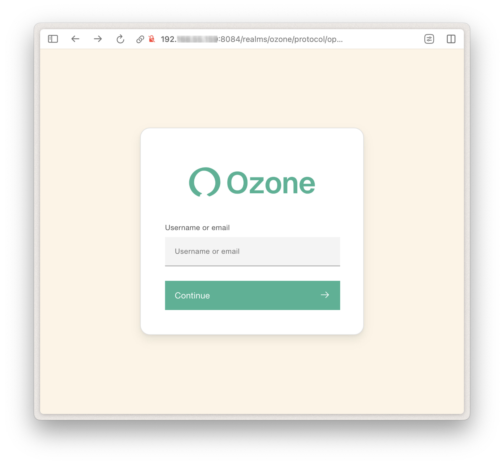

## Build

Build your distribution using Maven:

```bash
mvn clean package
```

??? info "Alernative with Maven Wrapper"
    You can use Maven Wrapper if Maven is not installed on your machine:
    ```bash
    ./scripts/mvnw clean package
    ```

## Run

First, move the directory where the run scripts are located:
```bash
source target/go-to-scripts-dir.sh
```


Run your Ozone distribution locally with SSO enabled and some demo data.
```bash
./start-demo-with-sso.sh
```

!!! info

    - Without SSO:
    ```bash
    ./start-demo.sh
    ```

    - Without demo data: 
    ```bash
    ./start-with-sso.sh
    ```


## Browse
Once started, the script will output the URLs to access the HIS apps and services:

For example:


Accessing any of those URLs should present you the Single Sign-On portal page:



Log in to the demo using username **jdoe** and password **password**.

You're ready to start browsing Ozone 👏 !

!!! warning ""

    🛠️ If you encounter an error when trying to access OpenMRS specifically, you may need to apply the following command to force a restart of the OpenMRS service.
    ```curl
    docker restart ozone-openmrs-1
    ```
## Stop or Destroy

Once you're done browsing Ozone, you can destroy the server to keep your environment clean.

```bash
./destroy-demo.sh
```

You can also just stop it, without destroying it:

```bash
./stop-demo.sh
```

## Limitations

!!! warning "'start.sh'  is not suitable for production"
    
    The scripts described on this page are not intended for production use. They are provided as utility tools to help implementers quickly run Ozone in a development environment, whether locally or in the cloud. To simplify setup, these scripts include default values for runtime options that would normally require customization in production, such as JVM settings, backup configurations, certificates and more.
