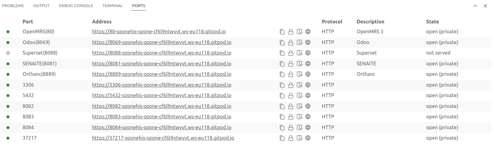

# Quick Start

## Try Ozone

3 options are available to you:

=== ":fontawesome-solid-globe: Online Demo"

    <pre>
    </pre>
    Visit [Ozone Demo :fontawesome-solid-up-right-from-square:](https://demo.ozone-his.com/){:target="_blank"}

    !!! info ""

        **Demo credentials**  
        Usermane: `jdoe`  
        Password: `password`

    
=== ":fontawesome-solid-location-dot: Locally"

    ## <a href="#install">Install</a>
    ```bash
    curl -s https://raw.githubusercontent.com/ozone-his/ozone/main/scripts/install-latest.sh | bash /dev/stdin
    ```

    ## <a href="#run">Run</a>
    ```bash
    cd ozone/run/docker/scripts/
    ./start-demo.sh
    ```

    !!! warning ""

        :fontawesome-regular-hourglass-half: It may take some time to download and setup Ozone for the first time.

    ## <a href="#browse">Browse</a>

    Then, start browsing Ozone. This requires you to log into each component separately:

    | HIS Component     | URL                            | Username | Password |
    |-------------------|--------------------------------|----------|----------|
    | OpenMRS 3         | http://localhost/openmrs/spa   | admin    | Admin123 |
    | SENAITE           | http://localhost:8081/senaite  | admin    | password |
    | Odoo              | http://localhost:8069          | admin    | admin    |
    | Superset          | http://localhost:8088          | admin    | password |


    !!! tip "**Did you know?**"

        Ozone Pro comes with [single sign-on](/users/sso) and all its interoperability layer is secured with OAuth2.

    
    ## <a href="#stop">Stop</a>
    ```bash
    ./stop-demo.sh
    ```

    ## <a href="#destroy">Destroy</a>
    ```bash
    ./destroy-demo.sh
    ```


=== ":simple-gitpod: Gitpod"

    ## <a href="#run">Run</a>

    One click here:
    
    [](https://gitpod.io/#https://github.com/ozone-his/ozone/)

    !!! warning ""

        :fontawesome-regular-hourglass-half: It may take some time to download and setup Ozone for the first time.

    ## <a href="#browse">Browse</a>

    When ready Gitpod will automatically launch a new tab for OpenMRS 3.

    You can also navigate to other Ozone components by clicking in the Gitpod window on the "Ports" section:

    


    Each component will require you to log separately:

    | HIS Component | Username | Password |
    |--------------|----------|----------|
    | OpenMRS 3    | admin    | Admin123 |
    | SENAITE      | admin    | password |
    | Odoo         | admin    | admin    |
    | Superset     | admin    | password |

    !!! tip "**Did you know?**"

        Ozone Pro comes with [single sign-on](/users/sso) and all its interoperability layer is secured with OAuth2.
